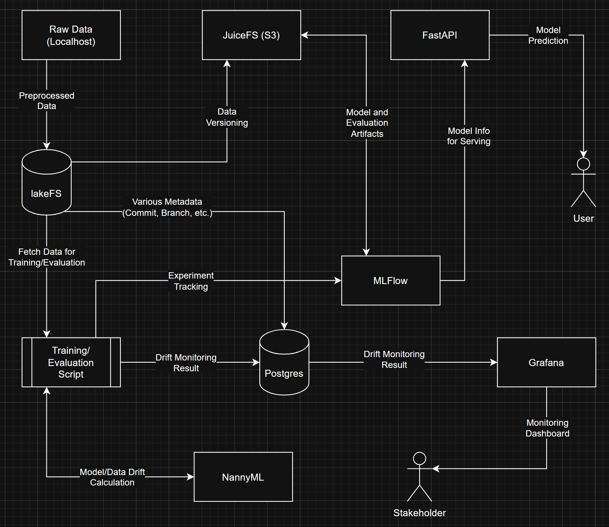

# Pet Pawpularity Prediction

Ever wondered how cute your pet is compared to other people's pet? Say no more! Just upload your cutest pet picture and my model will predict the pawpularity score for you.

The original goal if this project is to ease the process of pet adoption, by using the ML model, volunteers can take the best pet picture possible, and receive feedback from the model so they can change the pose, etc. to increase the pawpularity score. 

However, this feedback based solution is currently not completed yet (the embedding and web UI part), so only the pawpularity score will be outputed for now.

## Data Availability

The data is part of this [Kaggle competition](www.kaggle.com/c/petfinder-pawpularity-score/data), and I already received permission from PetFinder.my to use it in this project (I sent them an email). Still, you need to download the image files from Kaggle by yourself. I'm not including the images because the repo size will get considerably bigger, and for the privacy of the people/pet included in the images.

The original dataframe is already included in this repo though, and has been renamed from `train.csv` to `data.csv` to avoid confusion with data from the preprocessing step later.

## Architecture

## Stack

|Name|Description|
|-|-|
|JuiceFS|The default S3 object storage server (localhost) for storing the preprocessed data, can be switched to MinIO or Amazon if you want. I use `boto3` in the code, so any server will work|
|lakeFS|Data versioning on S3, more flexible than DVC. My data is not time series based so I use commit id as the unique identifier|
|PyTorch|The library used to train the model|
|MLFlow|Experiment tracking, and to store model evaluation result to be calculated by NannyML|
|NannyML|The drift report calculator, mainly because I find the Evidently `dict` report has no standardized structure/type hint, and can be a pain to upload to database|
|PostgreSQL|Database for storing the drift report info and other services data|
|Grafana|The dashboard to show visualization from PostgreSQL, only shows a simple drift and alert table for now (WIP)|
|Prefect|The workflow orchestrator, but can also work without it (you can just use `make` if you want)|
|Pydantic|Input validation, will get the required input values from CLI args or from the environment variables|
|FastAPI|To serve the model and show a simple web UI, may migrate to Streamlit later|

## Setup

1. Install Conda dependencies by running `make setup`
2. Prepare and run Docker compose using `make compose`
    - If it's your first time, Docker will download the required image files first (this may take a while)
    - Once everything is run, wait a bit (e.g. 30 seconds to 1 minute) so the services can initiate things
3. The Docker compose already has everything pre-configured except for lakeFS
    - Visit [lakeFS setup](http://localhost:8000/setup) URL to generate username and password
    - Copy the username and password to `.env.dev` file
    - [Login](http://localhost:8000/auth/login) to lakeFS with that username and password
    - Create a new repo with this settings:
        - Repository id: `pawpaw-repo`
        - Default branch: `main` (default)
        - Storage namespace: `s3://lakefs/pawpaw-repo`
4. Run the preprocess script (`make preprocess`) to upload the data to lakeFS repo
    - This will create a new commit to the lakeFS repo
5. Run the evaluation script (`make evaluate`)
    - This will automatically run the training workflow (`make train`) if needed (e.g. if no model yet or the test result is below the metric threshold), compare the models, and switch/mark the best model for you (by using a version alias)
    - If no drift report is generated, this is normal because we only have 1 commit so far and no reference data yet. To generate a drift report, we need a minimum of 2 commits (excluding the initial dummy commit)
    - Make sure you run an evaluation for each commit because the evaluation data is tied to the commit id. If a commit has no evaluation, it will be skipped because it can't find the evaluation data tied to that commit
6. To serve the best model, simply run the predict script (`make predict`)
    - Open the [web UI](http://localhost:8765) to test the image upload and pawpularity prediction (it will load the best model from MLFlow registry)
    - Currently it doesn't auto refresh the best model once you run it, I may improve it later
    - The port has been changed from 8000 to 8765 to avoid conflict with lakeFS