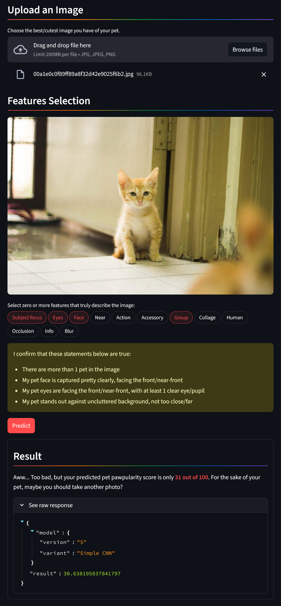
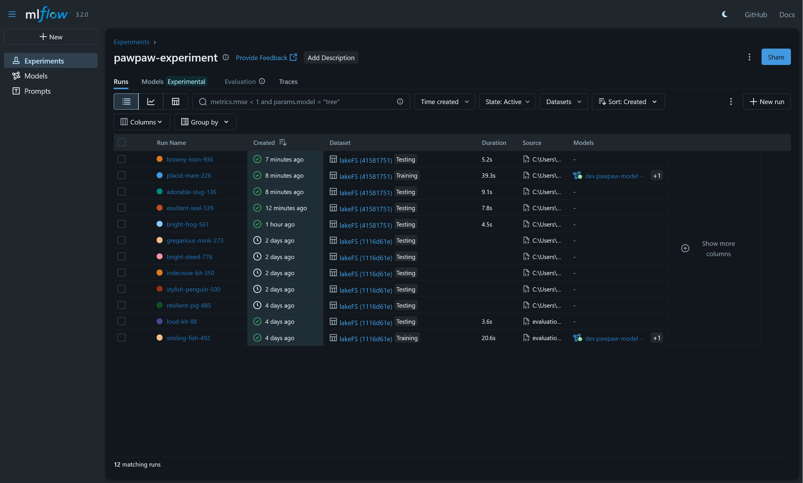
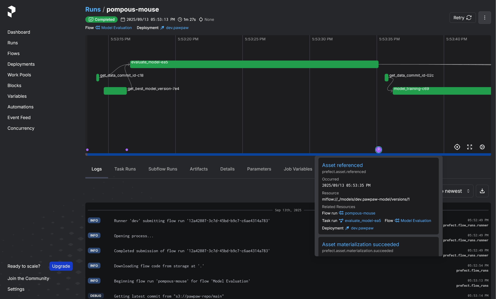
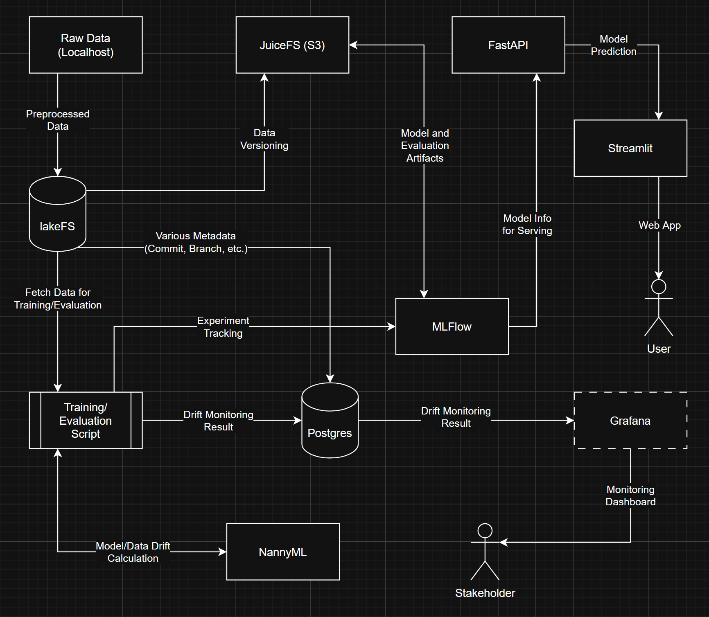

# Pet Pawpularity Prediction

Ever wondered how cute your pet is compared to other people's pet? Say no more! Just upload the best/cutest photo of your pet and my model will predict the pawpularity score for you.

The original goal if this project is to ease the process of pet adoption, by using the ML model, volunteers can take the best possible photo of their pet, and receive feedback from the model so they can change the pose, etc. to increase the pawpularity score. 

However, this feedback based solution is currently not completed yet (the embedding and vector store part). So, only the pawpularity score will be outputted for now.

## Screenshots

  
Streamlit web app

  
MLFlow tracking

  
Prefect orchestration

## Model

### Data Availability

The data is part of this [Kaggle competition](https://www.kaggle.com/c/petfinder-pawpularity-score/data), and I already received permission from PetFinder.my to use it in this project (I sent them an email).

The original CSV is already included in this repo, and has been renamed from `train.csv` to `data.csv` to avoid confusion with data from the data preprocessing step later.

Still, you need to download the image files from Kaggle by yourself. I'm not including the images because the repo size will get considerably bigger, and for the privacy of the people/pet included in the images.

### Performance

There's only 1 model variant used in the project, the baseline model (simple CNN), which achieved RMSE of 0.20 (meaning that the prediction missed by 20 points on average). For comparison, the current best model on Kaggle achieved RMSE of 0.17.

## Architecture

### Diagram

### Stack

|Name|Description|
|-|-|
|JuiceFS|The default S3 object storage server (localhost) for storing the data, can be switched to MinIO or Amazon S3 if you want. I use `boto3` in the code, so any server should work|
|lakeFS|Data versioning in the S3. My data is not really time series based so I use commit ids as the unique identifier. Unlike DVC, it doesn't save the tracked files data in the project directory, so the data commit is clearly separated from the source code commit|
|PyTorch|The ML library used to train the model, used together with Lightning Fabric to utilize the GPU when possible|
|MLFlow|Experiment tracking and model registry, and to store the model evaluation result, which can be used by NannyML to calculate the drift report|
|NannyML|The drift report calculator, mainly because I find the Evidently `dict` report has no standardized structure/type hint, and can be a pain to upload to database|
|PostgreSQL|Database for storing the drift report info and other services data (e.g. lakeFS)|
|Grafana|The dashboard to show visualization from PostgreSQL. Currently excluded from the compose file as I can't handle running all these services at the same time|
|Prefect|The pipeline orchestrator, and for remote deployment. Optional, you can just use `make` if you want|
|Pydantic|Input validation and type checking, will get the required input values from the CLI args or environment variables|
|FastAPI|To serve the model. I also included a simple test form to submit the prediction request|
|Streamlit|The prettier web app that can also be used to submit the prediction request. Not a standalone, must run side-by-side with the model server|
|Ruff|Code linter and formatter. Currently, I use it side-by-side with Pyright, and to avoid redundancy, only some rules are enabled|
|Uv|The awesome Python package manager, no need to call `source .venv/bin/activate` and other trivial stuff explicitly again|

### Services Port

  
Show

|Name|Docker Address|
|-|-|
|JuiceFS gateway and web UI|http://juicefs:9000|
|MLFlow tracking server|http://mlflow:5000|
|PostgreSQL gateway|http://postgres:5432|
|lakeFS gateway and web UI|http://lakefs:8000|
|Prefect server|http://prefect-server:4200|
|FastAPI model server|http://pawpaw-serving:8765|
|Streamlit web app|http://pawpaw-webapp:8501|

To access directly on host machine, just change the domain to `localhost`.

### Environment Variables

  
Show

There are 3 environment files:
- `compose.env`: Used by the services declared in the `compose.yaml` file
- `.env`: Used mostly for for the client side things (service address to connect to, model training parameters, etc.). Some values here may depend on the `compose.env` file too (e.g. username and password)
- `override.env`: Used by the deployed images (model server, web app, and Prefect workflows) to replace localhost with the compose host names. For this to work, the deployed image use the same network as the compose network

Variable definitions that are project specific (e.g. the model training parameters) are all written as Pydantic model attributes. See the Pydantic models code in the `_pydantic` folder.

## Usage

### First Time Setup

  
Show

1. Make a copy of the `.env.example` as `.env` file
    - Load the environment values into the current shell, by any means. [direnv](https://direnv.net/) is a popular solution, run `direnv allow` in this project directory to allow loading `.envrc` for this project (check the content first, may be dangerous)
    - When using VS Code with the Python extension installed, the `.env` file can also be loaded automatically (no need to use direnv), but only for the Python terminal (not any other terminal)
1. This project also uses [uv](https://docs.astral.sh/uv/), so you may need to install it first, then run `make setup` to let uv manage the Python package dependencies
    - The CUDA version of PyTorch will be used by default, but requires an Nvidia GPU to work. To use the CPU version (very slow), run `make setup-cpu` instead
    - A virtual environment (`.venv`) will be created in the root project directory when you run either of the commands above
2. Prepare and run Docker compose using `make compose-up`
    - Once the download is done and the services are being run, wait a bit more until all the services are truly ready (30 seconds should be enough)
    - Prefect services will also be run by default, but you can kill those containers manually if you don't want to use Prefect, or simply edit the `infra/docker-services/compose.yaml` file
3. The Docker compose already has everything pre-configured, except for lakeFS
    - Visit [lakeFS setup](http://localhost:8000/setup) URL to generate the username and password
    - Copy the username and password to the `.env` file, and reload your shell environment
    - [Login](http://localhost:8000/auth/login) to lakeFS with that username and password
    - Create a new repo with this settings:
        - Repository id: `pawpaw-repo`
        - Default branch: `main` (default)
        - Storage namespace: `s3://lakefs/pawpaw-repo`
4. If you want to use Prefect, you will also need to configure the Prefect worker network settings so the deployed workflows can communicate with other containers later
    - Visit [Prefect UI](http://localhost:4200) and login (password is in the `infra/docker-services/compose.env` file)
    - Go to "Work Pools" and click "Edit" on `pool-1` (I only set one pool with one worker in the compose file)
    - Scroll to "Networks" and use `["pawpaw_default"]` (the compose network name for this project) as the default network, then click "Save" at the bottom
    - Optionally, you may want to add `host.docker.internal` to your hosts file if you want to connect to port on the host machine directly. If you have Docker Desktop app, you can set this through the "General" settings

### Simple Mode

Simple mode doesn't use Prefect (only pure `make`), and the model server will be run directly on the host machine. However, MLFlow and other services will still be run on Docker (part of compose file).

  
Show

#### Data Preprocessing

1. Run the preprocess script (`make preprocess`) to upload the data to lakeFS repo
    - Each time this is run, a new commit containing random sample of the raw data will be created on lakeFS
    - We can treat these commits as unique monthly data, or data that are taken at different times from a streaming source

#### Model Training

  
Unused, click to show anyway

1. Run the training script (`make training`)
    - You should run the model evaluation below instead, which will also run the training process if needed
    - This command is only used by me during early development, when the evaluation/testing script was not created yet because it depends on this training script
    - Running training without evaluation will disconnect the model resulted from that training run, meaning that the model is unknown to the system (and will never be used) because no proper test/scoring was ever done to this model

#### Model Evaluation

The term testing is kinda reserved for unit/integration test. To avoid confusion, I will mostly call the model testing process as model evaluation instead.

1. Run the evaluation script (`make evaluation`)
    - This will automatically run the training workflow in case there's no model yet, or if the current model test result (tested with data from the newest commit) is below the metric threshold. The threshold is set via environment variable (e.g. from `.env` file)
    - At the end of training, the models will be evaluated and compared automatically. The evaluation is tied to the model and commit id, so if there are 2 models, there will be 2 evaluation results. Model with the best evaluation result will be marked with a version alias so we can easily load and serve it later
    - Because the evaluation process can be expensive, the evaluation result will be saved as MLFlow artifact. For past models/commit ids, we will load the existing evaluation data instead of running a new evaluation. These data can also be loaded for drift monitoring purpose
    - If no drift report is generated after an evaluation, this is normal because we only have 1 commit so far and no reference/previous data yet. To generate a drift report, we need a minimum of 2 commits (excluding the initial dummy commit), so you may want to re-run the data preprocessing step once again
    - Make sure you also run at least one evaluation for each data commit because the evaluation data is tied to the data commit id. If a commit has no evaluation, it will be skipped from drift report because it can't find the evaluation data tied to that commit
    - The drift report data will be saved to PostgreSQL database, and can be read by Grafana later. The database credentials can be set via environment variables, as usual

#### Model Serving and Web App

1. To serve the best model, simply run the server script (`make server`)
    - The Uvicorn port has been changed from 8000 to 8765 to avoid conflict with lakeFS
    - It will load the best model from MLFlow registry, via the model version alias we set during evaluation earlier
    - Currently it doesn't auto reload the best model once you run it (I'm not sure what's the best approach yet), but you still can visit the [/reload](http://localhost:8765/reload) endpoint to reload the model manually
2. To send prediction request to the served model, you can use the built-in [test form](http://localhost:8765), or run the newer, separate [Streamlit server](http://localhost:8501) (`make webapp`)

### Advanced Mode

The principle is the same as simple mode. However, advanced mode will use dockerized Prefect deployment to orchestrate the pipeline, and the model server will also be run through Docker (by building it as image first).

  
Show

#### Data Preprocessing, Model Training & Evaluation

1. Build the workflow image first (`make workflow-build`)
    - This will copy almost everything in our project directory, so you only need to refer to this image to do all the orchestration stuff later
    - The building process can be slow, it took about 19 minutes on my machine, excluding the dependencies download time
    - It will use the CPU version of PyTorch, since using GPU in Docker container is a bit complicated and I don't have time to configure it yet
2. Deploy it to Prefect server (`make workflow-deploy`)
    - This will only deploy the preprocess and evaluation workflow (not including training), since evaluation will also train a new model if neccessary (see "Simple Mode" for more details)
3. Visit the [Prefect UI](http://localhost:4200) and run the deployment (e.g. by clicking "Quick Run")
    - You can also add a schedule or trigger to automate these workflows from the UI
    - Adding schedule is also possible through the code, but I think tying it with the code will make it less flexible

#### Model Serving and Web App

1. Build the model server and web app image first (`make server-build` and `make webapp-build`)
2. Simply run `make server-run` and/or `make webapp-run` to run the image as container
    - This will be run in the same Docker network as the compose services
    - The server will fetch the best model version from MLFlow registry, which is marked during the model evaluation process
    - If you run the model evaluation from "Simple Mode", it will also be recognized, so you don't need use Prefect at all if you don't want it
3. Use the [simple web form](http://localhost:8765) (part of the model server), or the prettier [Streamlit app](http://localhost:8501) (the web app) to make the prediction request

## Misc

### Learning Notes

Some of my learning notes, which contains the reasons why I choose some tools/softwares over the others are located in the "misc/notes" folder. However, those notes may be outdated as I don't have time to revise them yet.

### Todo

Moved to [TODO.md](TODO.md) because it's too long and most people won't be interested in it anyway.